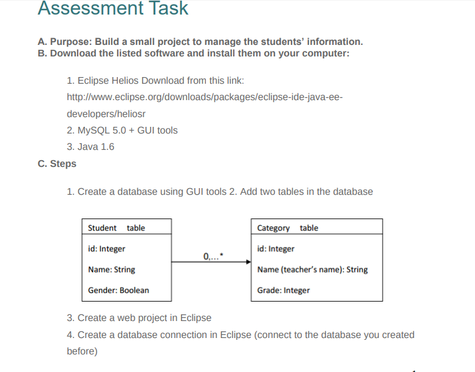
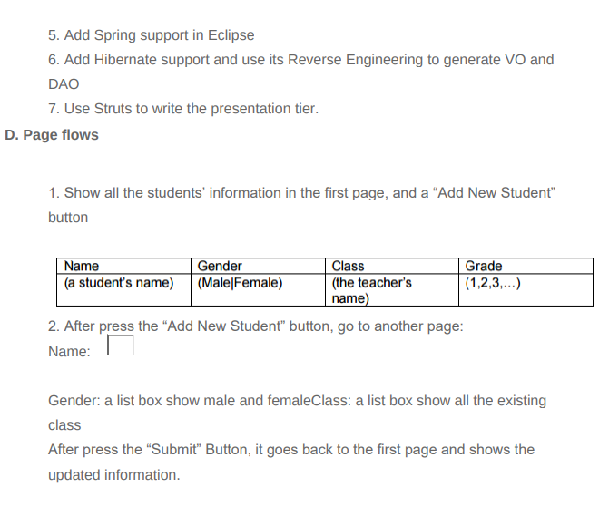

# struts-spring-hibernate
This small project is for an interview. Asked to finish in a week, finished in 4 days.
Never used Struts and hibernate before when I took this test.
The database desing is in test.sql.
The following is the screenshot of the requirement.

